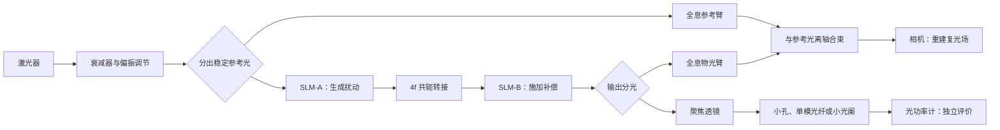

# Phase 3 实验准备：双 SLM 的 H0—H2 标定计划

## Material Passport

- Origin Skill: academic-research-suite / experiment-agent
- Origin Mode: plan
- Origin Date: 2026-07-24T09:32:39+08:00
- Verification Status: UNVERIFIED
- Version Label: dual_slm_h0_h2_plan_v1
- Upstream Dependencies:
  - `phase3-final-v1.1`
  - `docs/phase3_synthesis_and_gap_analysis.md`
- Hardware Declared by Researcher:
  - 两台西安中科微星 `FSLM-2K73-P04`
  - 一台光功率计

> `UNVERIFIED` 表示这是一份尚未实际执行的实验计划。产品参数经过厂家页面核对，但两台具体设备的性能必须重新实测。

---

## 1. 只看这一页

### 1.1 现在的实验条件比单 SLM 好很多

建议给两台设备固定分工：

- **SLM-A：扰动发生器**
  显示预先生成的相位屏，模拟随时间变化的像差或湍流。

- **SLM-B：补偿执行器**
  只接收控制器计算出的校正相位。

- **离轴全息相机：控制器的“眼睛”**
  重建经过两台 SLM 后的复光场。

- **光功率计：独立“裁判”**
  判断补偿后焦点或耦合功率是否真的提高。

这样可以避免同一块 SLM 同时制造问题又解决问题，也更容易分清每个动作的真实作用。

### 1.2 光功率计不能直接接在整束光后面

相位型 SLM 主要改变光的空间分布，理想情况下不会明显改变整束光的总功率。因此：

> **如果功率计把整束光全部收进去，即使相位校正成功，读数也可能几乎不变。**

正确做法是在 SLM-B 后加入聚焦透镜，再使用以下任一种方案：

1. 焦点处的小孔 + 功率计；
2. 单模光纤耦合 + 功率计；
3. 小于主焦斑范围的可调光阑 + 功率计。

这时功率读数才代表“光是否更加集中”，可以作为独立评价指标。

### 1.3 现在先不要训练 RL

下一步只做：

1. 查清激光器、相机和功率计型号；
2. 分别标定两台 SLM；
3. 不用 RL，先完成已知相位的制造与抵消；
4. 保存动作、时间戳、全息结果和功率结果。

H0—H2 全部通过后，再进入动态测试 H3。

### 1.4 直接使用的两个文件

为了避免第一次进实验室时面对整份长计划，可以先只用：

- `docs/phase3_h0_first_day_checklist.md`：按顺序打勾，完成首日 H0；
- `configs/hardware_inventory_template.yaml`：记录两台 SLM、激光器、相机和功率计的准确身份。

器材信息未填完整前，不进入 H1，也不开始训练 RL。

### 1.5 纯仿真可以同时进行

H0—H1 不需要阻塞电脑端工作。等待设备信息和实验室时间时，可以并行完成：

1. 修复 MATLAB 的空间相位屏与频域传播顺序；
2. 建立零湍流、能量守恒、接收面参考和动作敏感性测试；
3. 创建连续湍流的动态闭环环境；
4. 先实现直接相位补偿、积分器和 MPC 等非 RL 基线。

仿真中未知的 SLM 延迟、LUT、量化和配准误差先使用保守范围。H1 得到实测结果后，再替换为真实分布。RL 策略必须在硬件影子运行通过后才能发送到 SLM-B。

---

## 2. 已核验的 SLM 参数

以下参数来自[西安中科微星官方产品页](https://www.casmicrostar.com/h-pd-205.html)，核对日期为 2026-07-24。

| 项目 | `FSLM-2K73-P04` 参数 | 对实验的意义 |
|---|---|---|
| 调制类型 | 相位型 | 可加载相位校正 |
| 液晶结构 | 反射式 | 光路需要分光器或折叠结构 |
| 分辨率 | 2048 × 2048 | 可做像素级图案，但首轮只控制低阶模态 |
| 像元大小 | 6.4 μm | 有效面宽约 13.1 mm |
| 有效区域 | 13.1 mm × 13.1 mm | 光束必须完整落在标定区域内 |
| 开口率 | 93% | 仍会有像素结构和衍射级 |
| 灰度等级 | 8 位或 10 位可选 | 必须确认实验室两台设备的实际配置 |
| 1550 nm 相位范围 | ≥ \(2\pi\) | 与 1550 nm 相位校正相匹配 |
| 反射率 | 85 ± 5% @ 1550 nm | 两次反射后需要检查功率预算 |
| 标称刷新率 | 60 Hz | 一帧至少约 16.7 ms，但液晶稳定时间必须实测 |
| 数据接口 | HDMI | 需要两路独立输出，并关闭系统图像增强 |
| 电源 | 12 V、3 A | 两台设备分别稳定供电 |
| 厂家相位校正 | 支持 | 两台设备的校正文件不能互换 |
| 无水冷损伤阈值 | 20 W/cm² | 这是损伤上限信息，不是建议工作功率 |

厂家还给出 420—1700 nm 的宽光谱范围和 1064/1550 nm 特征波段，但**明确的 \(2\pi\) 相位保证是 1550 nm 条件**。不能因为表面能反光，就认为任意波长都已经正确标定。

项目 MATLAB 仿真目前设置为 `1550e-9 m`。这与 P04 的特征波长一致，但仍需要用激光器铭牌或说明书确认真实实验波长。

### 仍然未知，必须实测

- 两台设备究竟是 8 位还是 10 位配置；
- 两台设备各自的序列号、固件和厂家校正文件；
- 当前激光波长下的灰度—相位曲线；
- 液晶上升、下降和完全稳定时间；
- 温漂、迟滞和空间不均匀性；
- HDMI 链路是否改变灰度值；
- 两台设备之间及其与相机之间的坐标映射。

---

## 3. 推荐光路



这张图表示功能关系，不是最终机械安装图。由于两台 SLM 都是反射式，实际搭建通常需要非偏振分光器、偏振分光器或折叠反射镜。入射角、偏振方向和分光器选择必须以设备说明书和实验室激光安全规范为准。

### 为什么两台 SLM 之间建议先用 4f 共轭

首轮目标是验证“已知扰动能否被另一台设备抵消”。让 SLM-A 和 SLM-B 光学共轭，可以先把问题简化为同一光瞳面的相位相加：

```text
最终相位 ≈ SLM-A 扰动相位 + SLM-B 补偿相位
```

这能最快发现符号、坐标、缩放、旋转和相位查找表错误。以后若要产生更真实的闪烁或分布式传播，再把 SLM-A 放到非共轭位置并加入传播距离。

---

## 4. H0：设备建档与开机前检查

### H0-1 给两台 SLM 固定身份

在设备上贴不会遮挡散热和光路的标签：

- `SLM-A / 扰动`
- `SLM-B / 补偿`

记录：

| 字段 | SLM-A | SLM-B |
|---|---|---|
| 完整型号 | FSLM-2K73-P04 | FSLM-2K73-P04 |
| 序列号 | 待填 | 待填 |
| 灰度位深 | 待确认 | 待确认 |
| 固件版本 | 待确认 | 待确认 |
| 相位校正文件名 | 待填 | 待填 |
| HDMI 端口 | 待填 | 待填 |
| 电源编号 | 待填 | 待填 |

每个校正文件都要与对应序列号绑定，不能因为两台型号相同就交换使用。

### H0-2 核对激光与检测设备

必须填写：

| 设备 | 最少信息 | 为什么需要 |
|---|---|---|
| 激光器 | 型号、波长、输出功率、线偏振方向 | 判断是否与 P04 相位标定和安全要求匹配 |
| 全息相机 | 型号、感光波段、帧率、曝光、接口、触发方式 | 决定闭环能够多快 |
| 光功率计 | 主机和探头型号、波长范围、量程、采样率、电脑接口 | 判断能否记录动态评价 |
| 聚焦评价组件 | 透镜、小孔、光纤或光阑 | 把相位改善转换成功率改善 |

若激光不是 1550 nm，不要直接使用厂家 1550 nm 查找表，必须重新测量完整灰度—相位曲线。

### H0-3 关闭电脑端的图像改写

两台 SLM 通过 HDMI 接入电脑后：

- 按厂家软件或说明书设置 HDMI 输出时序，并确认相位图与 2048 × 2048 有效像素正确映射；
- 如果 Windows 没有直接提供 2048 × 2048 显示模式，不要自行强改显卡时序，先使用厂家软件、SDK 或向厂家确认；
- 缩放设为 100%；
- 关闭 HDR、夜间模式、色彩增强、自动对比度和动态范围处理；
- 使用灰度图，禁止插值缩放；
- 确认程序输出的一个像素对应 SLM 的一个像素；
- 检查系统是否把 8 位灰度转换为有限范围视频灰度；
- 记录显示器编号，不允许窗口误移到另一台 SLM。

先显示纯黑、纯白、50% 灰度、水平渐变和棋盘格，人工确认两台设备分别显示正确图案。

### H0-4 激光安全

- 1550 nm 激光不可见，仍可能造成眼损伤；
- 使用适合实际波长和功率的护目镜、封闭光路、光阑和光束终止器；
- 从实验室允许的最低功率开始；
- 反射式 SLM 会产生镜面反射和高阶衍射，所有未使用光束必须终止；
- 先测光束在 SLM 上的实际面积，再计算功率密度；
- 不把厂家损伤阈值当作日常工作功率目标；
- 不在无人值守情况下运行激光标定。

本计划不替代实验室激光安全负责人、设备说明书或本单位安全规程。

### H0 通过条件

- 两台 SLM、激光器、相机和功率计身份记录完整；
- 两个 HDMI 输出能独立显示正确灰度图；
- 每台 SLM 的厂家校正文件已与序列号绑定；
- 相机和功率计探头支持实际激光波长；
- 功率计支路已经具有焦面选择元件；
- 激光安全检查完成。

任一项缺失时，不进入 H1。

---

## 5. H1：分别标定两台 SLM

两台设备必须分别执行完整 H1，不能只标定一台后复制结果。

### H1-1 灰度—相位曲线

建议使用现有离轴全息系统或半屏干涉法：

1. 一半区域保持参考灰度；
2. 另一半区域依次改变灰度；
3. 重建两区域的相位差；
4. 对相位差展开；
5. 得到“输入灰度 → 实际相位”的曲线。

8 位设备可先扫描：

```text
0, 4, 8, ..., 252, 255
```

连续做三轮：

1. 灰度递增；
2. 灰度递减；
3. 再次递增。

这样可以同时看到重复性和迟滞。若设备是 10 位，应按相近采样密度覆盖完整输入范围。

每个灰度点保存：

- 原始全息图；
- 重建相位；
- 平均强度；
- 相位差；
- 采集时间；
- SLM 温度或开机时长；
- 使用的偏振设置。

输出文件：

```text
data/hardware_calibration/slm_a/gray_phase_raw.csv
data/hardware_calibration/slm_a/phase_lut.csv
data/hardware_calibration/slm_b/gray_phase_raw.csv
data/hardware_calibration/slm_b/phase_lut.csv
```

### H1-2 相位与振幅是否串扰

相位型设备也可能因偏振或液晶状态产生强度变化。灰度扫描时同时检查：

- 相位是否单调；
- 强度是否随灰度明显变化；
- 相位能否覆盖实验需要的范围；
- 递增和递减曲线是否一致；
- 1550 nm 条件下是否接近厂家给出的 ≥ \(2\pi\)。

如果强度变化很大，优先重新调偏振，而不是直接训练网络补偿。

### H1-3 空间平坦度和厂家校正图

对每台设备分别显示均匀灰度，测量整个有效光瞳的残余相位：

1. 不加载厂家校正图；
2. 加载该设备自己的厂家校正图；
3. 比较残余相位；
4. 保存两种相位图和统计量。

若厂家校正后反而变差，先检查文件是否对应正确序列号、波长和设备方向。

### H1-4 液晶稳定时间

60 Hz 只表示显示刷新周期约为 16.7 ms，不等于液晶已经稳定。

测试方法：

1. 在两个相差较大的安全相位之间交替显示；
2. 用能够快速记录的相机、光电探测器或功率计采集变化过程；
3. 分别测上升、下降和达到稳定范围所需时间；
4. 重复多个灰度跨度。

若现有光功率计采样太慢，就用相机或额外光电探测器测响应时间。正式闭环周期必须大于“显示传输 + 液晶稳定 + 相机曝光 + 重建”的实测总时间。

### H1-5 模态响应与影响矩阵

对每台 SLM 依次加载小幅正、负模态：

- X/Y 倾斜；
- 离焦；
- 两个方向的像散；
- 需要时再加入彗差。

每次测量实际产生的复场变化，形成：

```text
命令模态系数 → 实际测得模态系数
```

这张表就是 SLM 的影响矩阵。以后动作维数由：

- 哪些模态确实可控；
- 模态之间串扰多大；
- 实际扰动能量集中在哪些模态；

共同决定，不预先固定为 8 个或 15 个。

### H1-6 坐标映射

分别显示棋盘格、稀疏圆点或小幅相位光栅，求出：

- SLM-A → SLM-B 的旋转、缩放、平移和翻转；
- SLM-B → 全息相机的坐标映射；
- 两台 SLM 的有效光瞳区域。

映射参数保存为独立版本文件。每次移动相机、透镜或 SLM 后都要重新检查。

### H1 通过条件

- 两台 SLM 都得到独立的灰度—相位查找表；
- 相位覆盖满足当前实验所需范围；
- 正、负模态产生正确方向的变化，且变化大于重复测量噪声；
- 液晶稳定时间已经实测；
- 厂家平坦度校正的作用已经验证；
- 两台 SLM 与相机的坐标映射稳定；
- 没有无法解释的严重强度串扰。

H1 不通过时，不做双 SLM 闭环。

---

## 6. H2：不用 RL 先证明双 SLM 闭环有效

### H2-0 先建立四个参考值

每次实验块开始和结束都测量：

1. 功率计暗值；
2. 输入或平坦图案参考功率；
3. 全息系统平坦参考相位；
4. 两台 SLM 都显示安全平坦图案时的输出。

若只有一台功率计，参考功率可以在每个实验块前后顺序测量；不同方法的运行顺序必须随机化，以减小激光漂移影响。

归一化焦点功率可以写成：

```text
归一化焦点功率 =
（焦点功率 - 暗值）/（参考功率 - 暗值）
```

### H2-A 只测试 SLM-B

目标：证明全息测量能够控制补偿器。

1. SLM-A 保持安全平坦图案；
2. 测量系统原有像差；
3. 计算受约束反相位；
4. 加载到 SLM-B；
5. 等待实测稳定时间；
6. 重新采集全息图和焦点功率。

期望：

- 残余相位减小；
- 经小孔、光纤或小光阑采集的焦点功率增大。

如果全息相位改善而焦点功率不变，优先检查非共路误差、焦面位置和功率计支路，而不是训练 RL。

### H2-B 已知静态扰动的抵消

目标：证明 SLM-A 和 SLM-B 的符号及坐标正确。

1. SLM-A 分别加载小幅倾斜、离焦和像散；
2. 控制器只根据全息测量计算补偿；
3. SLM-B 加载校正；
4. 记录动作前后复场和焦点功率；
5. 正、负扰动都要测试。

SLM-B 可以使用 SLM-A 的真实图案做一次“理想上限”检查，但该结果只能用于排查光路，不能作为可部署控制器性能。

### H2-C 盲测静态序列

目标：证明控制器不是偷看 SLM-A 的相位文件。

1. 提前生成一组扰动图案；
2. 由独立程序控制 SLM-A；
3. 控制器进程不能读取扰动系数或文件名；
4. 控制器只能看到全息测量和历史 SLM-B 命令；
5. 测试顺序随机；
6. 完整扰动真值只在实验结束后用于离线分析。

首轮只做先导重复，用来估计系统波动，不用于发表显著性结论。正式重复次数在先导方差得到后再确定。

### H2 的两个主要指标

1. **控制指标**：动作后的残余相位均方根或选定模态残差；
2. **独立指标**：归一化焦点功率或单模光纤耦合功率。

整束光总功率只能用来监控能量和安全，不能作为相位校正成功的主要指标。

### H2 结果解释

| 结果 | 含义 | 下一步 |
|---|---|---|
| 相位改善，焦点功率也改善 | 闭环链路基本正确 | 可以进入 H3 |
| 相位改善，焦点功率不改善 | 全息面与科学面可能不一致 | 检查焦面、分光和非共路误差 |
| 相位不改善，焦点功率改善 | 可能在优化局部聚焦，但全息模型或配准有问题 | 暂停，查清评价冲突 |
| 两者都不改善 | 符号、LUT、坐标、偏振或共轭关系有误 | 不进入 RL |
| 只有读取 SLM-A 真值才改善 | 不具备可部署性 | 修正观测和进程隔离 |

### H2 通过条件

- 盲测情况下，校正前后变化方向在重复试验中稳定；
- 改善幅度大于 H0—H1 测得的重复性波动；
- 功率计结果来自焦面选择支路，而不是整束总功率；
- SLM-A 真值没有泄漏给控制器；
- 失败、饱和和异常图案均被记录；
- 任何异常时都能回到最后一个已验证安全图案。

---

## 7. 双 SLM 系统的证据边界

### 第一阶段：双 SLM 硬件在环

SLM-A 数字生成扰动，SLM-B 校正。它比单 SLM 方案更可信，因为扰动与校正使用不同器件，但仍应称为：

> **双 SLM 硬件在环自适应光学实验。**

它不能完全代表传播路径中的自然大气湍流。

### 第二阶段：独立物理扰动

更强证据是在 SLM-B 前加入：

- 热空气湍流；
- 旋转相位板；
- 独立传播介质。

此时 SLM-B 只做校正。SLM-A 可保留用于标定或关闭，不再承担测试扰动。

---

## 8. 数据记录格式

每个动作至少保存：

| 字段 | 说明 |
|---|---|
| `run_id` | 独立实验编号 |
| `condition_id` | 扰动和控制条件 |
| `timestamp_camera_start` | 相机开始曝光时刻 |
| `timestamp_reconstruction_done` | 全息重建结束时刻 |
| `timestamp_command_ready` | 控制命令计算完成时刻 |
| `timestamp_slm_b_sent` | 图案发送给 SLM-B 的时刻 |
| `timestamp_measurement_after` | 动作后测量时刻 |
| `slm_a_serial`、`slm_b_serial` | 两台设备身份 |
| `slm_a_pattern_id` | 扰动图案编号；控制器不可见 |
| `slm_b_pattern_id` | 补偿动作编号 |
| `lut_a_version`、`lut_b_version` | 两台查找表版本 |
| `registration_version` | 坐标映射版本 |
| `phase_metric_before/after` | 动作前后相位指标 |
| `power_dark` | 功率计暗值 |
| `power_reference` | 参考功率 |
| `power_focus_before/after` | 焦点功率 |
| `saturated` | 是否饱和 |
| `dropped_frame` | 是否丢帧 |
| `reconstruction_failed` | 是否重建失败 |
| `fallback_used` | 是否回退 |

建议输出：

```text
data/hardware_calibration/
├── hardware_inventory.yaml
├── slm_a/
│   ├── gray_phase_raw.csv
│   ├── phase_lut.csv
│   ├── flatness_map.h5
│   └── response_time.csv
├── slm_b/
│   ├── gray_phase_raw.csv
│   ├── phase_lut.csv
│   ├── flatness_map.h5
│   └── response_time.csv
├── registration/
│   ├── slm_a_to_slm_b.json
│   └── slm_b_to_camera.json
└── h2_dual_slm/
    ├── transitions.csv
    ├── holograms/
    └── phase_fields/
```

这些路径是规划，不代表文件已经生成。

---

## 9. H2 后的算法决策

只有 H2 通过，且 H3 证明系统存在可利用的时间规律后，才进入控制算法选择：

1. 扰动基本静态：直接相位补偿、Zernike 拟合或 SPGD；
2. 动态但近似线性：积分器、LQG 或 MPC；
3. 非线性模型明显优于线性模型：
   比较“同一非线性模型 + MPC”和“同一非线性模型 + PO4AO 式 RL”；
4. 残差 SAC 作为第二 RL 对照；
5. PPO 暂时留在仿真。

两台 SLM 并不会自动证明 RL 有必要。它们只是让这个问题能够被更干净地检验。

---

## 10. 还缺的最少信息

要把这份计划继续变成具体元器件连接图和采集代码，只缺：

1. 激光器型号、实际波长和输出功率；
2. 全息相机型号、接口和最高帧率；
3. 光功率计主机及探头型号；
4. 是否已有 1550 nm 聚焦透镜、小孔、单模光纤或可调光阑；
5. 两台 SLM 的厂家软件、SDK、校正文件和序列号是否齐全。

在这些信息确认前，不确定的具体透镜焦距、分光比例、曝光时间、控制周期和安全动作幅值保持 `TBD`。
